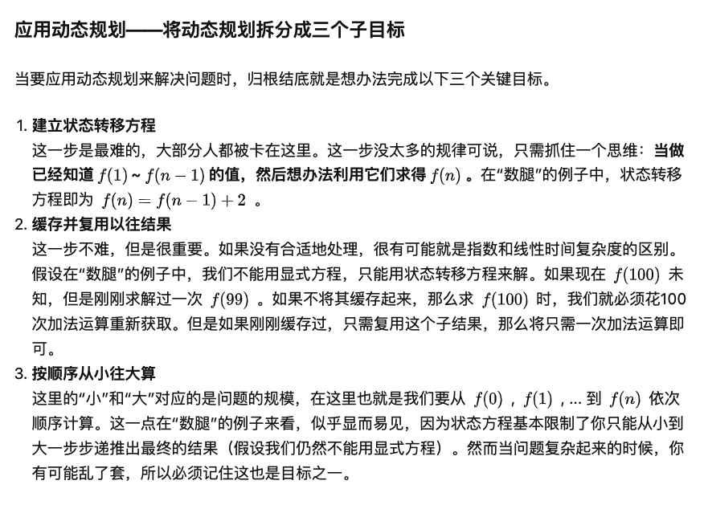

# 5. 最长回文子串
网址：https://leetcode-cn.com/problems/longest-palindromic-substring/

## My Solution
​	当头一棒是不知道什么是回文子串，查了一下是指像level这种正反读都一样的字符串。

​	我的解法，用栈和字符串上的指针来判断是不是回文字符串，对字符串上的每个字符都针对奇偶两种情况（aba、aa）做检测，我不知道时间复杂度是多少，最差的情况就是像“aaaaaaaa”这样的吧，时间复杂度是O(n2)？最好的情况就是没有回文子串，就是O(n)？

​	时间很慢，但是不知道为什么空间还可以……可以思考一下有没有必要用栈这个结构，是不是使用两个字符串指针就可以了？

## 动态规划

​	这是我第一次接触到动态规划（Dynamic programming）的题目，需要学习一下这个概念。什么是动态规划？bw教我是“把大问题分成很多小问题来解决”，这个口头描述能让我想到递归……

​	参考网址：https://www.zhihu.com/question/39948290

看完后其实动态规划和递归不是一回事！最简单的入门DP题斐波那契数列就没有使用递归。摘录一下DP题最核心的思想：

## Official Solution