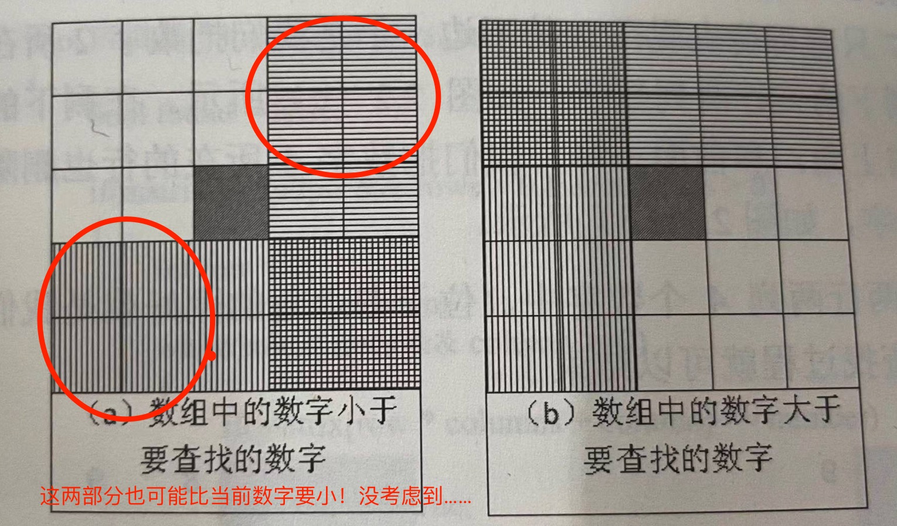

# Offer04.二维数组中的查找
- 网址：https://leetcode-cn.com/problems/er-wei-shu-zu-zhong-de-cha-zhao-lcof/

- 日期：2021.11.02

  

## Description

在一个 n * m 的二维数组中，每一行都按照从左到右递增的顺序排序，每一列都按照从上到下递增的顺序排序。请完成一个高效的函数，输入这样的一个二维数组和一个整数，判断数组中是否含有该整数。

## My Solution

呕吐，想横纵做两次二分查找，结果发现压根没那么容易！看下图：

写了半天递归的二分查找，结果白写了。总结经验教训：下笔开始写算法前一定要把思路想清楚再写……不然真浪费时间orz

然后就看标准答案了。

## Official Solution

说是像二叉搜索树，还没刷到这个数据结构，反正就是从右上角或左下角开始遍历，当前数字大了就往左，小了就往下，把重叠部分规避掉了属于是。

